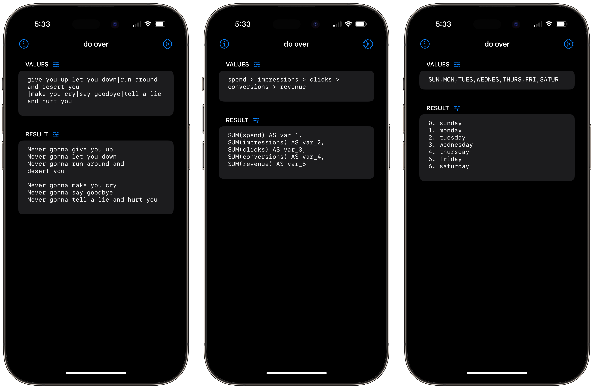
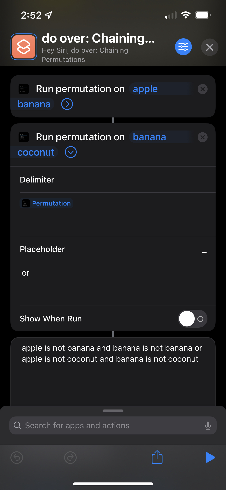

[appstore]: https://apps.apple.com/us/app/{{ pager.app.slug }}/id{{ page.app.id }}

[][do over]

---

- Want to quickly create some similar text without manually typing everything out? do over can do that.
- Want to quickly and easily change the values and see the results in realtime? do over can do that.
- Want to use a different placeholder in the template? do over can do that.
- Want to see how the merged results will look using different joins? do over can do that.
- Want to be successful in life? do over, unfortunately, cannot do that.
- Want to unknowingly share your data with who-knows-who? do over [can't help you with that](./privacy/).

Provide a list of values (`apple banana coconut … zucchini`, for example) along with a template to use (such as `?i. ?`), and do over generates merged output:

    1. apple
    2. banana
    3. coconut
    …
    26. zucchini

---

# Inspiration & Motivation

I used to write a lot of SAS code.
A pair of SAS macros were transformative for me.
I'd often found myself mimicking that functionality in bash.
[I wrote about it.](/post/do-over/)

---

# AppClip

**Try it out via an AppClip!** Scan the thingie below for a basic, interactive demo.

![][app-clip]

---

# Shortcuts

Version 1.4 introduces two Shortcuts.app actions:

- Permutate Text - runs the basic permutations. helper functions (e.g., \days, \help, \1-5) are not available in this action.
- Resolve Range - resolves ranges (e.g., -10--4, 1-5).

As with most things in Shortcuts.app, you can feed output from one action as a parameter into another action. For example, [this](https://www.icloud.com/shortcuts/2dcec0a841ca49e68a44da686414ffbb) shortcut:

{: width="250" }

---

# Examples



## {{ ex.heading }}

{{ ex.description }} _[Here]({{- ex.shortcuts_link -}}) is a shortcut demonstrating this._

<table>
  <thead>
    <tr>
      <th colspan="2">Action/Field</th>
      <th>Value/Setting</th>
    </tr>
  </thead>
  
  <tbody>
    <tr>
      <th colspan="3"></th>
    </tr>
    <tr>
      <th rowspan="5">S T E P  {{- forloop.index -}}</th>
      <td style="text-align: right">Values</td>
      <td><pre>{{- step.values -}}</pre></td>
    </tr>
    <tr>
      <td style="text-align: right">Delimiter</td>
      <td>{{- step.delimiter -}}</td>
    </tr>
    <tr>
      <td style="text-align: right">Template</td>
      <td><pre>{{- step.template -}}</pre></td>
    </tr>
    <tr>
      <td style="text-align: right">Placeholder</td>
      <td>{{- step.placeholder -}}</td>
    </tr>
    <tr>
      <td style="text-align: right">Joiner</td>
      <td>{{- step.joiner -}}</td>
    </tr>
  </tbody>
  
  <tfoot>
    <tr><th colspan="2">Result</th><td><pre>{{- ex.result -}}</pre></td></tr>
  </tfoot>
</table>



---

# Terms

Feel free to use [{{ page.app.name }}][appstore] at your leisure for whatever purpose you have in mind.

**Refunds**

All [{{ page.app.name }}][appstore] purchases are final. I cannot issue refunds charged to your Apple ID, but you can ask [Apple](https://support.apple.com/en-us/118223) to do so.

---

# Privacy

**Data Collection**

[{{ page.app.name }}][appstore] does not collect _any_ data.

**Data Sharing**

Given the above point, [{{ page.app.name }}][appstore] cannot share data. [{{ page.app.name }}][appstore] is a SwiftUI app and makes use of Apple's developer libraries exclusively; no external libraries. These Apple libraries do not, to the best of my knowledge, collect data.

**Data Retention**

Since [{{ page.app.name }}][appstore] does not collect data, [{{ page.app.name }}][appstore] cannot retain data.

---

# Support

_do over_ is organized into the following sections:

- **Values** is the place to enter your variables. The adjacent settings button lets you make changes to these raw values.
- **Result** shows the resulting permutation. The adjacent settings button lets you take actions on the result, including pipine back into the **Values** section.
- **Settings** is the place to make adjustments to underlying permutation settings.
    - _Values_ allows you to specify the value list delimiter to use. The adjacent settings button allows you to quickly clear the delimiter (Using an empty value delimiter will split the Values at each character) and, if you're on iOS, offer to insert the tab character in the delimiter field.
    - _Template_ is where you specify the pattern to riff on and what token the pattern represents where the value item goes. The adjacent settings button offers some quick actions as well as inserting the flags for changing casings.
    - _Result_ is where you specify the permutation join string. The adjacent settings button offers some quick actions.
- **About**
    - _Help_ offers some helpful things.
    - _Miscellaneous Debris_ is my nod to Primus and some self-serving links.
    - _Do Over_ offers some user actions and technical information related to the app.

There's not much that can go wrong with [{{ page.app.name }}][appstore]. That said, if after restarting your device and reproducing the issue you think you've found a bug, please reach out; I don't like bugs either.

---

[do over]: https://apps.apple.com/us/app/do-over-text-permutations/id1618131760
[app-clip]: ./app-clip-code-tagged.svg
