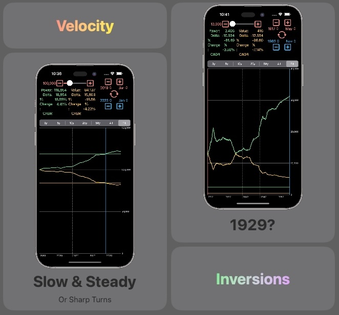

[appstore]: https://apps.apple.com/us/app/{{ page.app.slug }}/id{{ page.app.id }}

Introducing [{{ page.app.name }}][appstore] – Your Time Machine for Money Value!

Ever wondered how much a dollar from 1913 would be worth today? Or how the purchasing power of your savings has changed over the decades?  [{{ page.app.name }}][appstore] is here to demystify the complex world of monetary value fluctuation, providing you with a clear window into the past, present, and future of your money.

With  [{{ page.app.name }}][appstore], explore the evolution of money's real value and purchasing power with monthly precision since 1913. Whether you're a history buff, an investor, or simply curious about how economic forces have shaped the value of money over time,  [{{ page.app.name }}][appstore] offers a wealth of information at your fingertips.

# Features
- **Real Value Calculations:** Discover the historical value of money, adjusting for inflation, and see how much past amounts would be worth in today's dollars.
- **Purchasing Power Analysis:** Understand how far your money could go in different eras. Could you buy more bread in 1920 or 2020? flation tells you precisely that.
- **Monthly Precision:** Our calculations go down to the month, offering an unparalleled depth of insight into the fluctuating value of money since 1913.
- **Easy-to-Use Interface:** Navigate through time with ease, thanks to a user-friendly design that makes historical financial data accessible to everyone.

 [{{ page.app.name }}][appstore] is more than just an app; it's your personal financial historian, a tool that brings the economic past into the present to help inform your future decisions. Perfect for educators, students, economists, or anyone who wants to gain a deeper understanding of the forces that shape our financial world.

Download [{{ page.app.name }}][appstore] now and start your journey through the annals of monetary history. Witness the ebb and flow of economies, understand the true value of money through time, and arm yourself with knowledge that transcends the ages.

Calculations based on [U.S. Consumer Price Index (CPI)](https://www.bls.gov/cpi/), "a measure of the average change over time in the prices paid by urban consumers for a market basket of consumer goods and services." Data via [U.S. Bureau of Labor Statistics](https://data.bls.gov/timeseries/CUUR0000SA0).

# Inspiration

I wanted to play a simple app to calculate an arbitrary value in terms of point-in-time purchasing power and real value. I also wanted a simple visualization of these calculation over time.

# Terms

Feel free to use [{{ page.app.name }}][appstore] at your leisure for whatever purpose you have in mind.

**Future Versions**

[{{ page.app.name }}][appstore] is currently free to download and use. At some future point, [{{ page.app.name }}][appstore] may become a paid-up-front app. When this transition occurs, a purchase will be required for continued use of [{{ page.app.name }}][appstore].

**Refunds**

All [{{ page.app.name }}][appstore] purchases are final. I cannot issue refunds charged to your Apple ID, but you can ask [Apple](https://support.apple.com/en-us/118223) to do so.

**For Reference Only**

[{{ page.app.name }}][appstore] is not intended for, and should not be used for future-looking purchase power or real value.

# Privacy

**Data Collection**

[{{ page.app.name }}][appstore] does not collect _any_ data.

**Data Sharing**

Given the above point, [{{ page.app.name }}][appstore] cannot share data. [{{ page.app.name }}][appstore] is a SwiftUI app and makes use of Apple's developer libraries exclusively; no external libraries. These Apple libraries do not, to the best of my knowledge, collect data.

**Data Retention**

Since [{{ page.app.name }}][appstore] does not collect data, [{{ page.app.name }}][appstore] cannot retain data.

# Support

There's not much that can go wrong with [{{ page.app.name }}][appstore]. That said, if after restarting your device and reproducing the issue you think you've found a bug, please reach out; I don't like bugs either.
